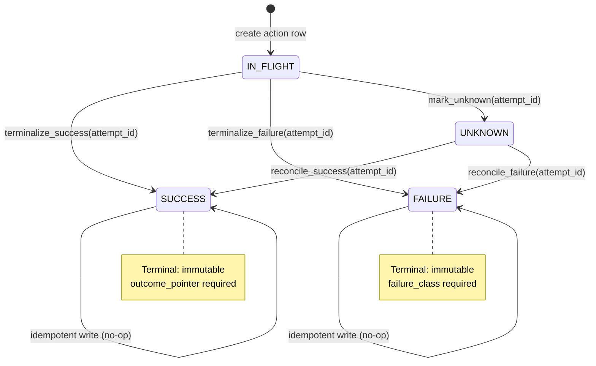
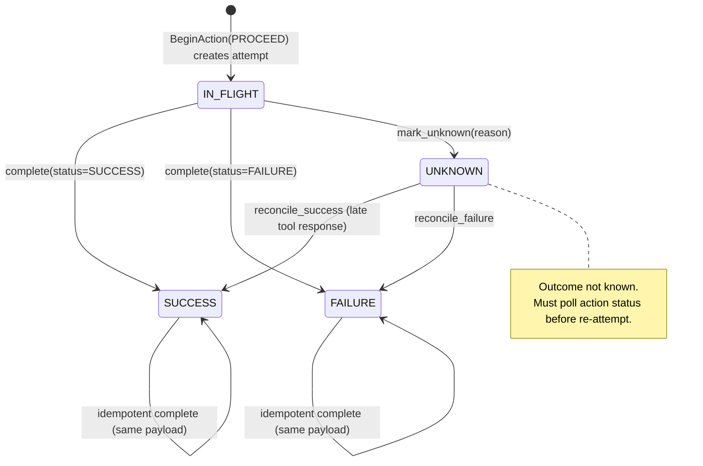
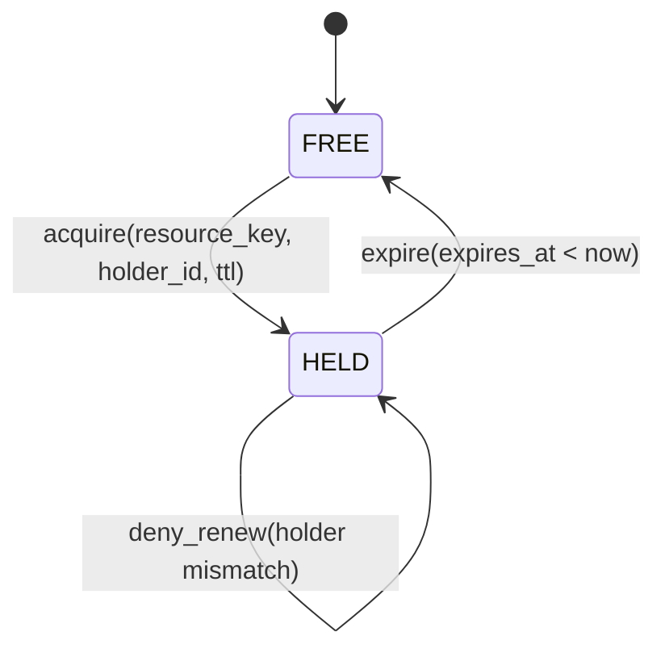
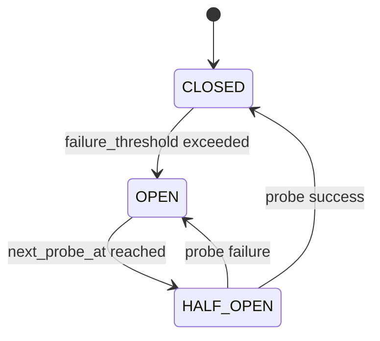
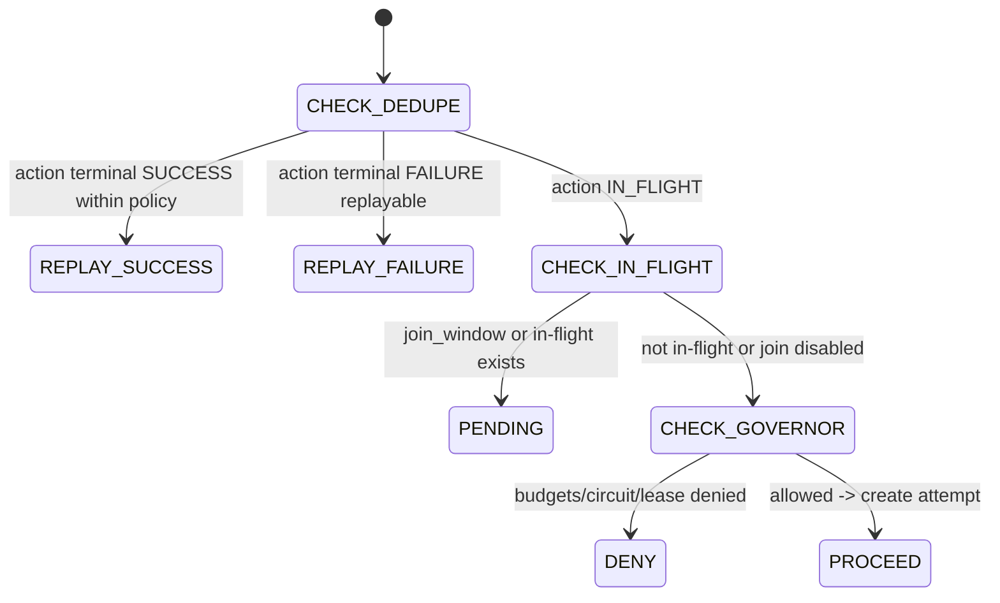

\

# RunwayCtrl — State Machines + Invariants Spec (v0.1)

| Field      | Value                                                                               |
| ---------- | ----------------------------------------------------------------------------------- |
| Product    | RunwayCtrl                                                                          |
| Doc Type   | State Machines + Invariants Spec                                                    |
| Version    | v0.1                                                                                |
| Date       | January 21, 2026                                                                    |
| Applies to | Control Plane API + DB ledger + SDK behavior                                        |
| Goal       | Make behavior _provably consistent_ under retries, concurrency, and partial failure |

---

## 1) What this spec is

This is the **behavior contract** for how RunwayCtrl evolves state over time.

It defines:

- the **state machines** for Actions, Attempts, Leases, and Circuits
- **allowed transitions** (and which are forbidden)
- **invariants** (truths that must always hold)
- **atomicity rules** (what must happen in a single transaction)
- **idempotency rules** (what to do on duplicate calls)

This document is intended to be “compiler-level strict”: if code violates this, it’s a bug.

---

## 2) Key entities (quick recap)

- **Action**: a semantic intent identified by `action_key` (idempotency surface)
- **Attempt**: one execution try for an action (`attempt_id`)
- **Lease**: TTL lock on `resource_key` (optional v0.1)
- **Circuit**: circuit breaker state for (tool, action)

---

## 3) Non-negotiable invariants (global)

### I0 — Tenant isolation (MUST)

All rows are scoped by `tenant_id`. No cross-tenant reads/writes.

### I1 — Terminal states are immutable (MUST)

If an entity is terminal, it MUST NOT transition to a different state.

Terminal sets:

- Action: SUCCESS, FAILURE
- Attempt: SUCCESS, FAILURE
- Lease: (not terminal; TTL-based)
- Circuit: (not terminal; cycles)

### I2 — Idempotent replays MUST be safe (MUST)

Calling `completeAttempt(SUCCESS)` twice with the same payload must be a no-op.
Calling it with a different payload must be CONFLICT.

### I3 — Unknown outcome is the only “retriable ambiguity” (MUST)

If tool call outcome is unknown, the client MUST:

1. mark attempt UNKNOWN
2. poll action status
3. only re-attempt if action not terminal

### I4 — Denials MUST NOT create attempts (MUST)

If governor denies BeginAction (budget/circuit/lease), the server MUST return an error and MUST NOT create a new Attempt row.

### I5 — Decision responses are not errors (MUST)

PENDING is a normal control-plane response, not an exception.

---

## 4) State machines (Mermaid)

> Mermaid sources are also included in `Documentation/*.mmd`.

### 4.1 Action state machine



### 4.2 Attempt state machine



### 4.3 Lease state machine



### 4.4 Circuit breaker state machine



### 4.5 BeginAction decision state machine (control plane)



---

## 5) Action invariants (table: `actions`)

### A1 — Primary key uniqueness

- Exactly one action row per `(tenant_id, action_key)`.

### A2 — Terminal fields must exist

- If `actions.status='SUCCESS'` then `outcome_pointer IS NOT NULL` and `terminal_attempt_id IS NOT NULL`
- If `actions.status='FAILURE'` then `failure_class IS NOT NULL` and `terminal_attempt_id IS NOT NULL`

### A3 — Attempt count monotonicity

- `attempt_count` is monotonic non-decreasing.

### A4 — Action status monotonicity (partial order)

Allowed status transitions:

- IN_FLIGHT → SUCCESS / FAILURE / UNKNOWN
- UNKNOWN → SUCCESS / FAILURE

Forbidden:

- SUCCESS → anything else
- FAILURE → anything else
- UNKNOWN → IN_FLIGHT

### A5 — Dedupe correctness constraint (recommended)

Within a dedupe window, any BeginAction with the same `(tenant_id, action_key)` MUST return:

- REPLAY\_\* (if terminal), or
- PENDING / PROCEED (if not terminal)
  and MUST NOT create duplicate actions.

---

## 6) Attempt invariants (table: `attempts`)

### T1 — Attempt must belong to exactly one action

- FK: `(tenant_id, action_key)` must exist in actions.

### T2 — Terminal immutability

- Once status ∈ {SUCCESS, FAILURE}, status cannot change.
- UNKNOWN may transition to SUCCESS/FAILURE only via reconciliation.

### T3 — Completion idempotency

For a given `(tenant_id, attempt_id)`:

- repeated completion with identical terminal status + identical outcome_hash/outcome_pointer/failure_class returns 200
- completion with different terminal result returns 409 CONFLICT

### T4 — Unknown marking idempotency

- marking UNKNOWN repeatedly is safe and returns 200 (no state change after first)
- UNKNOWN MUST NOT wipe any terminal fields if already terminal

---

## 7) Lease invariants (table: `leases`) (optional v0.1)

### L1 — Single holder per resource

- PK: `(tenant_id, resource_key)` ensures one active row at a time.

### L2 — Acquire is atomic and respects expiry

Acquire rules:

- If no row exists: create row (GRANTED)
- If row exists and `expires_at < now()`: replace holder (GRANTED)
- If row exists and not expired: DENIED

### L3 — Renew requires holder match (CAS)

- renew only if `holder_id` matches current holder
- otherwise DENIED

### L4 — Expiry is time-based, not explicit

- a lease is effectively FREE when `expires_at < now()` (cleanup can be async)

---

## 8) Circuit invariants (table: `circuits`) (optional v0.1)

### C1 — Circuit key determinism

- `circuit_key` is derived from `{tool}:{action}` (and optionally tenant policy scope).
- Must be stable to avoid circuit fragmentation.

### C2 — OPEN implies probe schedule

- if `state='OPEN'`, then `next_probe_at IS NOT NULL`

### C3 — HALF_OPEN is single-probe

- in HALF_OPEN, allow only a limited number of probes (typically 1 concurrently)

---

## 9) Atomicity requirements (the “must be in one transaction” list)

### X1 — BeginAction(PROCEED) MUST be atomic

Within one DB transaction:

1. upsert/read `actions` row for `(tenant_id, action_key)`
2. verify not terminal (or return REPLAY)
3. apply governor checks (budget/circuit/lease) — denial exits without side effects
4. create `attempts` row with status IN_FLIGHT
5. increment `actions.attempt_count`
6. emit `attempt_events` (optional, but recommended)

If any step fails, the whole thing rolls back.

### X2 — Attempt completion → Action terminalization MUST be atomic

When completing an attempt:

1. terminalize attempt (CAS update)
2. decide if action should terminalize (policy)
3. if terminalizing action: set action.status + terminal_attempt_id + fields
4. emit attempt_event(s)

This ensures you never end up with:

- terminal action pointing to non-terminal attempt
- terminal attempt without a terminal action when policy says it must terminalize

---

## 10) Allowed transitions (explicit guard table)

### 10.1 Attempt transitions

| From      | To        | Allowed? | Guard                                 |
| --------- | --------- | :------: | ------------------------------------- |
| IN_FLIGHT | SUCCESS   |   Yes    | `completeAttempt` with status=SUCCESS |
| IN_FLIGHT | FAILURE   |   Yes    | `completeAttempt` with status=FAILURE |
| IN_FLIGHT | UNKNOWN   |   Yes    | `markUnknown`                         |
| UNKNOWN   | SUCCESS   |   Yes    | reconciliation / late response        |
| UNKNOWN   | FAILURE   |   Yes    | reconciliation                        |
| SUCCESS   | SUCCESS   |   Yes    | idempotent identical completion       |
| FAILURE   | FAILURE   |   Yes    | idempotent identical completion       |
| SUCCESS   | FAILURE   |    No    | must return CONFLICT                  |
| FAILURE   | SUCCESS   |    No    | must return CONFLICT                  |
| UNKNOWN   | IN_FLIGHT |    No    | forbidden                             |

### 10.2 Action transitions

| From      | To      | Allowed? | Guard                                      |
| --------- | ------- | :------: | ------------------------------------------ |
| IN_FLIGHT | SUCCESS |   Yes    | terminalize due to successful attempt      |
| IN_FLIGHT | FAILURE |   Yes    | terminalize due to failed attempt (policy) |
| IN_FLIGHT | UNKNOWN |   Yes    | if governing logic marks action unknown    |
| UNKNOWN   | SUCCESS |   Yes    | reconciliation                             |
| UNKNOWN   | FAILURE |   Yes    | reconciliation                             |
| SUCCESS   | \*      |    No    | immutable                                  |
| FAILURE   | \*      |    No    | immutable                                  |

---

## 11) Canonical CAS update patterns (Postgres)

### 11.1 Attempt completion CAS (must prevent double terminalization)

```sql
-- Terminalize attempt if it is not already terminal.
UPDATE attempts
SET
  status = $status,
  failure_class = $failure_class,
  outcome_hash = $outcome_hash,
  outcome_pointer = $outcome_pointer,
  tool_http_status = $tool_http_status,
  tool_request_id = $tool_request_id,
  latency_ms = $latency_ms,
  trace_id = $trace_id,
  updated_at = now(),
  completed_at = now()
WHERE
  tenant_id = $tenant_id
  AND attempt_id = $attempt_id
  AND status IN ('IN_FLIGHT','UNKNOWN');
```

If `rowcount=0`, read current row:

- if already terminal with identical payload: return 200
- else: return 409 CONFLICT

### 11.2 Action terminalization CAS (prevents flipping terminals)

```sql
UPDATE actions
SET
  status = $status, -- SUCCESS or FAILURE
  terminal_attempt_id = $attempt_id,
  outcome_pointer = $outcome_pointer,
  failure_class = $failure_class,
  updated_at = now()
WHERE
  tenant_id = $tenant_id
  AND action_key = $action_key
  AND status NOT IN ('SUCCESS','FAILURE');
```

### 11.3 Lease acquire (atomic upsert with expiry guard)

```sql
INSERT INTO leases (tenant_id, resource_key, holder_id, expires_at, created_at, updated_at)
VALUES ($tenant_id, $resource_key, $holder_id, now() + ($ttl_ms || ' milliseconds')::interval, now(), now())
ON CONFLICT (tenant_id, resource_key)
DO UPDATE SET
  holder_id = EXCLUDED.holder_id,
  expires_at = EXCLUDED.expires_at,
  updated_at = now()
WHERE leases.expires_at < now(); -- only steal if expired
```

If affected rows = 0, acquisition was DENIED.

---

## 12) Safety rails: trigger recommendations (optional but strong)

For v0.1, app-level CAS is enough. But if you want “seatbelts + airbags”:

- Trigger: reject any UPDATE that changes terminal status to another status
- Trigger: reject attempt status transitions that violate the allowed transition table
- Trigger: ensure action terminal fields exist when status is terminal

These can be added later as the system hardens.

---

## 13) Files in this export

- `Documentation/01-state-machines-and-invariants.md` (this file)
- `Documentation/02-action-state.mmd`
- `Documentation/03-attempt-state.mmd`
- `Documentation/04-lease-state.mmd`
- `Documentation/05-circuit-state.mmd`
- `Documentation/06-decision-state.mmd`
