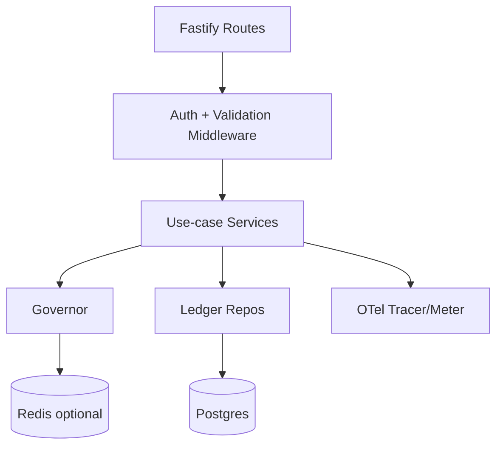

\

# RunwayCtrl — Backend Structure Document (v0.1)

| Field            | Value                                                        |
| ---------------- | ------------------------------------------------------------ |
| Product          | RunwayCtrl                                                   |
| Doc Type         | Backend Structure                                            |
| Version          | v0.1                                                         |
| Date             | January 21, 2026                                             |
| Primary Audience | Backend/Platform Engineering                                 |
| Scope            | Control Plane API + Ledger + Governor + Auth + Observability |

---

## 1) Purpose

This document defines the **backend service structure** for RunwayCtrl so implementation in VSCode stays coherent as the codebase grows.

It covers:

- repo layout
- service boundaries
- module boundaries
- request lifecycle
- data access conventions
- error taxonomy
- observability wiring
- deployment shape

---

## 2) Backend architecture (v0.1)

### Core services

- **Control Plane API** (single service initially)
  - action begin / attempt lifecycle
  - leases
  - governance decisions
  - read APIs for status / forensics

### Core stores

- **Postgres** (system of record)
  - actions, attempts, attempt_events, leases, tenants, api_keys
- **Redis** (optional accelerator)
  - budgets counters, short TTL rate-limit hints (never source-of-truth)

### Core integrations

- **OpenTelemetry** (traces + metrics)
- **Auth** (API key middleware; tenant isolation)

---

## 3) Monorepo structure (canonical)

> **This is the single source of truth for folder structure.**
> Other docs (Tech Stack, Implementation Plan) should reference this section.

```
/apps
  /control-plane
    /src
      /api              # route registration & handlers
      /domain           # core concepts: Action, Attempt, Lease, Budget
      /services         # orchestration services (use-cases)
      /governor         # policy + budget + backoff + circuiting
      /ledger           # repository layer (DB reads/writes)
      /auth             # API keys, tenant resolution, RBAC (later)
      /observability    # OTel wiring, metrics, logging correlation
        /analytics        # Ledger Insights: aggregation worker, insights queries, insights service, Hub analyzer
        /hub              # The Hub: LLM analysis job, hub service, provider adapter
      /config           # env parsing, defaults, feature flags
      /errors           # error classes, mapping to HTTP, taxonomy
      /utils            # hashing, normalization, time, ids
      /migrations       # DB migrations (SQL)
      index.ts
  /console              # minimal read-only dashboard (v0.1)
    /src
      /app              # Next.js app router pages
      /components       # UI components (shadcn/ui)
      /lib              # API client, utilities
      /hooks            # TanStack Query hooks
/packages
  /shared              # shared types/schemas (Zod) for SDK + API
  /db                  # DB client setup, query helpers, tx helpers
  /sdk-core            # keying, hashing, normalization, OTel helpers
  /sdk-node            # Node-specific HTTP client + exporters
  /integrations-jira            # Jira wrapped actions (v0.1)
  /integrations-servicenow      # ServiceNow wrapped actions (v0.1)
  /integrations-github           # GitHub wrapped actions (v0.1)
/docs
  /spec
  /prd
  /tech
  /frontend
  /backend
```

---

## 4) Service boundaries and responsibilities

### 4.1 API layer (`/api`)

- Pure HTTP concerns:
  - validation (Zod)
  - auth middleware
  - request context (tenant, request_id)
  - mapping domain errors → HTTP responses
- No business logic beyond wiring.

### 4.2 Domain layer (`/domain`)

Defines the language of the system:

- `ActionKey`, `ResourceKey`, `AttemptId`, `TenantId`
- enums: `AttemptStatus`, `FailureClass`, `LeaseState`, `CircuitState`
- invariants: what must always be true

### 4.3 Services / Use-cases (`/services`)

Orchestrate one “thing the system does,” e.g.:

- `BeginActionService`
- `CompleteAttemptService`
- `MarkAttemptUnknownService`
- `AcquireLeaseService`
- `GetActionStatusService`
- `InsightsService` (cost summary, tool efficiency, retry waste, hotspots — reads from `execution_daily_stats`)
- `HubService` (LLM-powered execution analysis — reads from `execution_daily_stats`, writes to `hub_analyses`, serves `GET /v1/insights/hub`)

Services:

- call Governor to decide
- call Ledger repositories in transactions
- return typed results

### 4.4 Governor (`/governor`)

The policy engine:

- budgets (token-bucket/leaky bucket style counters)
- jittered backoff computation
- attempt caps
- circuit breaker state (open/half-open/closed)
- “storm detection” triggers (spike heuristics)

Key rule:

- Governor is _policy + decisions_, not storage.
- Durable policy state lives in Postgres; ephemeral hints can live in Redis.

### 4.5 Ledger (`/ledger`)

Repository layer:

- no HTTP types
- no governance policy
- just data access patterns with strongly typed results

### 4.6 Auth (`/auth`)

- API key verification (hash compare)
- tenant resolution (api_key → tenant_id)
- RBAC scaffolding (roles later)

### 4.7 Observability (`/observability`)

- OTel tracer + meter init
- common attributes injection (tenant_id, request_id, action_key, attempt_id)
- metrics registry (counters/histograms)

### 4.8 Analytics (`/analytics`)

Read-only intelligence layer that mines the durable ledger:

- `aggregation-worker.ts` — scheduled background job (cron or pg_cron) that computes daily stats from raw ledger data into `execution_daily_stats`.
- `insights-queries.ts` — parameterized SQL for aggregation and insight queries.
- `insights-service.ts` — business logic for the `/v1/insights/*` API endpoints.
- `hub-analyzer.ts` — orchestrates the Hub analysis job: gathers aggregated stats, sends prompt to LLM provider, validates response with Zod, persists to `hub_analyses`. Runs after the aggregation worker daily.
- `hub-service.ts` — business logic for the `GET /v1/insights/hub` endpoint (reads pre-computed insights from `hub_analyses`).
- `hub-provider.ts` — provider adapter abstraction for LLM calls (default: OpenAI GPT-5.2; configurable via `RUNWAYCTRL_HUB_PROVIDER`).

Key rules:

- Analytics queries NEVER touch the hot write path (actions/attempts tables) at request time.
- All insight API reads come from `execution_daily_stats` (pre-aggregated).
- Hub analysis reads from `execution_daily_stats` and writes to `hub_analyses` — never touches the hot write path.
- Hub is gated by `ENABLE_HUB` feature flag; inactive when disabled.
- Aggregation runs during off-peak hours; is idempotent (UPSERT).
- Emits OTel metrics: `runwayctrl.insights.aggregation.duration_ms`, `runwayctrl.insights.aggregation.rows_computed`.
- Exposes `/internal/insights/health` for worker liveness.

---

## 5) Request lifecycle (end-to-end)

### 5.1 Begin Action (canonical)

1. Validate request schema
2. Authenticate API key → tenant_id
3. Start trace span: `runwayctrl.begin_action`
4. Normalize args → derive action_key/resource_key if needed
5. Call Governor:
   - check budgets
   - check circuit state
6. Transaction:
   - upsert action (action_key unique)
   - create attempt (attempt_id)
   - optionally acquire lease (resource_key)
   - append attempt events
7. Return:
   - `attempt_id`
   - headers for tool call (idempotency key if relevant)
   - retry plan (if denied or delayed)

### 5.2 Complete Attempt

1. Validate
2. Auth
3. Span: `runwayctrl.complete_attempt`
4. Transaction:
   - mark attempt terminal
   - append event
   - if action terminal, set terminal pointers
   - release/expire lease (optional; TTL is default)
   - **persist `rate_limit_headers` (jsonb)** — captured from the tool response by the SDK and forwarded on CompleteAttempt. Provider-specific structure:
     - Jira: `{ "jira-quota-global-based": "...", "jira-quota-tenant-based": "...", "jira-burst-based": "...", "jira-per-issue-on-write": "...", "retry-after": "..." }`
     - ServiceNow: `{ "x-ratelimit-remaining": "...", "x-ratelimit-limit": "...", "retry-after": "..." }`
     - GitHub: `{ "x-ratelimit-remaining": "...", "x-ratelimit-limit": "...", "x-ratelimit-reset": "..." }`
5. Emit metrics + close span

---

## 6) Data access patterns (transactions matter)

### 6.1 Golden rule

Any operation that changes semantics must be **atomic**.

Atomic operations:

- upsert action + create attempt
- acquire lease
- complete attempt + mark action terminal

Implementation:

- wrap in a single Postgres transaction with SERIALIZABLE or REPEATABLE READ where needed
- use unique constraints as the “truth enforcement” mechanism

### 6.2 Repository pattern

- `ActionRepo.upsert(...)`
- `AttemptRepo.create(...)`
- `AttemptRepo.complete(...)`
- `LeaseRepo.acquire(...)`
- `EventRepo.append(...)`
- `InsightsRepo.queryStats(...)` (read-only, from `execution_daily_stats`)
- `HubRepo.getLatestAnalysis(...)` (read-only, from `hub_analyses`)
- `HubRepo.saveAnalysis(...)` (write, to `hub_analyses`)

### 6.3 Background workers

- **Insights aggregation worker** (`/analytics/aggregation-worker.ts`):
  - Runs on a configurable schedule (default: daily at 02:00 UTC).
  - Aggregates raw ledger data (actions + attempts + attempt_events) into `execution_daily_stats`.
  - Uses UPSERT for idempotent re-runs.
  - Must not hold long-running transactions on the write tables.
  - Emits OTel spans and metrics for monitoring.
  - Failure mode: if aggregation fails, stale data persists (safe degradation — insights are never authoritative for correctness).

- **Hub analysis job** (`/hub/hub-analyzer.ts`):
  - Runs after the aggregation worker (daily, configurable).
  - Reads aggregated stats from `execution_daily_stats`; sends a structured prompt to the configured LLM provider.
  - Validates LLM response with Zod; persists to `hub_analyses`.
  - Gated by `ENABLE_HUB` feature flag and `RUNWAYCTRL_HUB_MIN_DATA_DAYS` threshold.
  - Emits OTel spans (`runwayctrl.hub.analyze`) and metrics (`runwayctrl.hub.analysis.duration_ms`, `runwayctrl.hub.analysis.insights_generated`).
  - Failure mode: if Hub analysis fails, stale or empty insights persist — no impact on correctness.

All repos accept:

- `tx` (transaction client)
- `tenant_id`
- typed inputs

---

## 7) Data model (backend-facing view)

### 7.1 Tables

- `tenants`
- `api_keys`
- `actions`
- `attempts`
- `attempt_events`
- `leases`
- `execution_daily_stats` (analytics aggregates — see Data Model Spec Section 5.9)
- `hub_analyses` (Hub LLM analysis results — see Data Model Spec Section 5.10)
- `policies` (optional v0.1; can hardcode defaults initially)
- `circuits` (optional; can embed in policies or derive)

### 7.2 Constraints (must exist)

- `actions(tenant_id, action_key)` unique
- `attempts(tenant_id, attempt_id)` primary key
- `attempts(tenant_id, action_key, started_at)` index
- `leases(tenant_id, resource_key)` unique
- `attempt_events(tenant_id, attempt_id, ts)` index

---

## 8) Error taxonomy (backend standard)

### 8.1 Domain errors (typed)

- `ValidationError`
- `AuthError`
- `NotFoundError`
- `ConflictError` (lease conflicts, duplicate attempt state)
- `BudgetDeniedError`
- `CircuitOpenError`
- `RateLimitError`
- `TimeoutUnknownError` (used for classification; not thrown from API usually)

### 8.2 HTTP mapping (opinionated)

- 400: ValidationError
- 401/403: AuthError
- 404: NotFoundError
- 409: ConflictError (lease conflict)
- 429: BudgetDeniedError / RateLimitError
- 503: CircuitOpenError
- 500: everything else

Every error response includes:

- `request_id`
- `error_code`
- `message` (operator readable, non-leaky)
- `retry_after_ms` when relevant

---

## 9) Observability wiring (backend)

### 9.1 Trace spans

- `runwayctrl.begin_action`
- `runwayctrl.acquire_lease`
- `runwayctrl.complete_attempt`
- `runwayctrl.mark_unknown`
- `runwayctrl.get_action_status`

### 9.2 Required span attrs

- `runwayctrl.tenant_id`
- `runwayctrl.action_key`
- `runwayctrl.attempt_id`
- `runwayctrl.resource_key`
- `runwayctrl.tool`
- `runwayctrl.action`
- `runwayctrl.outcome`
- `runwayctrl.failure_class`
- `runwayctrl.retry_count`

### 9.3 Metrics (minimum)

Counters:

- `runwayctrl_actions_begun_total`
- `runwayctrl_attempts_created_total`
- `runwayctrl_attempts_completed_total`
- `runwayctrl_attempts_unknown_total`
- `runwayctrl_budget_denied_total`
- `runwayctrl_lease_denied_total`
- `runwayctrl_circuit_open_total`

Histograms:

- `runwayctrl_begin_action_latency_ms`
- `runwayctrl_complete_attempt_latency_ms`
- `runwayctrl_lease_wait_ms`

---

## 10) Configuration and feature flags

### 10.1 Config sources

- environment variables (v0.1)
- config file support later

### 10.2 Feature flags (examples)

- `ENABLE_REDIS_BUDGETS`
- `ENABLE_CIRCUIT_BREAKER`
- `ENABLE_LEASES`
- `ENABLE_PAYLOAD_CAPTURE` (default false)
- `ENABLE_HUB` (default false — The Hub LLM analysis layer)

Keep flags server-side; do not expose to untrusted clients.

---

## 11) Security and privacy implementation notes

- API keys are stored hashed (never plaintext).
- Tenant isolation enforced in every query (tenant_id is mandatory).
- Payload capture is off by default; store hashes/pointers only (see `Documentation/ADR-0009-payload-capture-stance.md`).
- If payload capture is enabled later, store full artifacts in external object storage and keep only pointers in Postgres.
- PII redaction happens before persistence (if enabled).

---

## 12) Testing strategy (backend)

### 12.1 Unit tests

- hashing/normalization
- governor decisions (budgets/backoff/circuit)
- error mapping

### 12.2 Integration tests (critical)

- begin_action transaction atomicity
- lease acquisition conflicts
- dedupe and replay correctness
- “unknown outcome” retry path

### 12.3 Load tests (early but essential)

- high concurrency begin_action
- lease contention hotspots
- budget denial behavior under 429 storm simulation

---

## 13) Deployment shape

### v0.1

- single control-plane service
- managed Postgres
- optional managed Redis
- OTel collector (sidecar or hosted)

### v0.2+

- separate “read API” pool for forensics queries (protect writes)
- background jobs for retention cleanup
- event stream for analytics

---

## 14) Implementation checklist (backend)

- [ ] Repo layout matches section 3
- [ ] Postgres migrations + constraints installed
- [ ] BeginAction + CompleteAttempt flows implemented
- [ ] Lease acquire/renew implemented (TTL)
- [ ] Governor budgets/backoff implemented
- [ ] OTel spans + metrics emitted
- [ ] Error taxonomy consistent across API
- [ ] Integration tests for concurrency and partial failure

---

## 15) Appendix — Minimal “control plane” service skeleton (conceptual)


