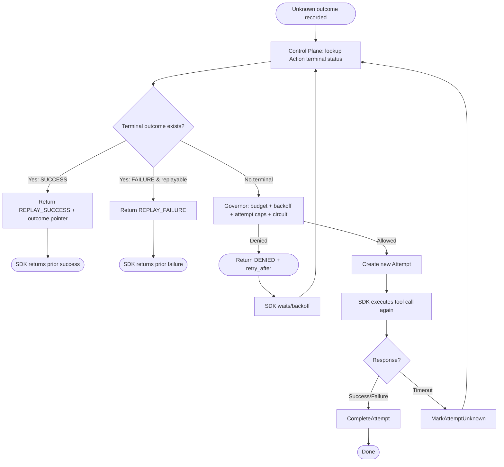
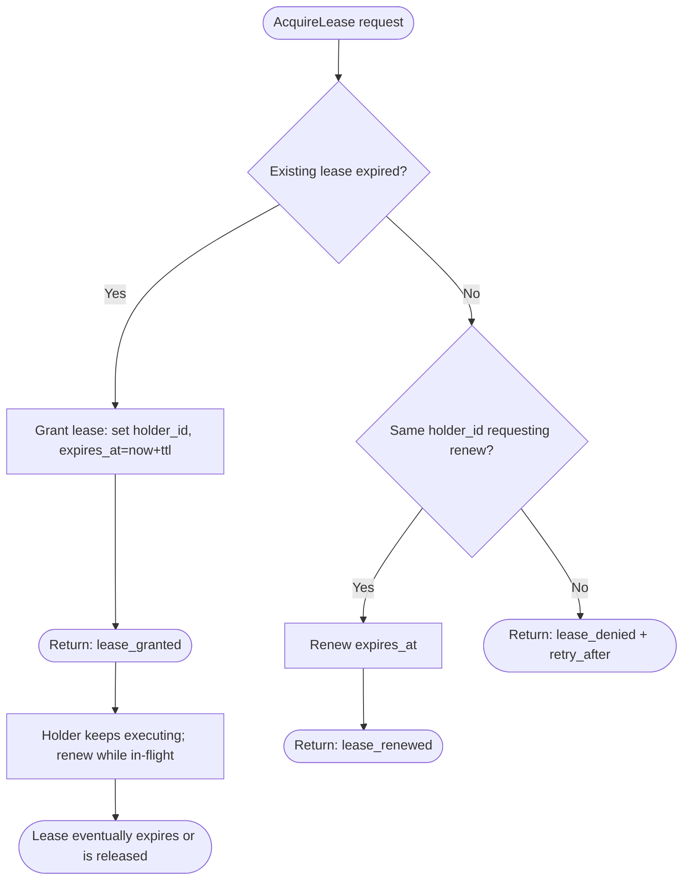
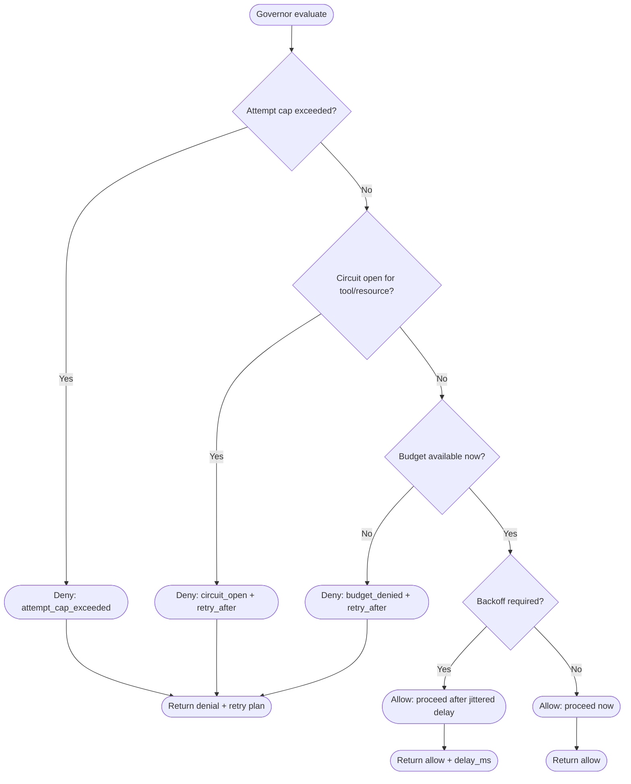

\

# RunwayCtrl — Flow Chart Document (v0.1)

| Field    | Value                                                          |
| -------- | -------------------------------------------------------------- |
| Product  | RunwayCtrl                                                     |
| Doc Type | Flow Charts                                                    |
| Version  | v0.1                                                           |
| Date     | January 21, 2026                                               |
| Purpose  | Visualize core backend execution logic as flowcharts (Mermaid) |
| Audience | Engineering + Design Partners (implementation alignment)       |

---

## 1) How to use this document

- These diagrams are the **authoritative control-plane decision flows**.
- Keep them in sync with code. If behavior changes, update the flowchart in the same PR.
- Mermaid diagrams render well in VSCode (Mermaid preview extensions) and in most docs sites.

---

## 2) System-level flow (end-to-end)

```mermaid
flowchart LR
  A[Agent / App] --> S[RunwayCtrl SDK]
  S -->|BeginAction| C[Control Plane API]
  C -->|Policy decisions| G[Governor]
  C -->|Atomic writes| L[(Postgres Ledger)]
  G -->|Soft counters (optional)| R[(Redis optional)]
  S -->|Execute tool call| T[Tool API]
  S --> O[OTel Exporter / Collector]
  C --> O

  L -->|Status / outcome pointer| C
  C -->|Proceed / RetryPlan / Replay| S
```

---

## 3) BeginAction flowchart (canonical decision tree)

**Goal:** Given a tool intent, decide whether to **replay**, **proceed**, **wait**, or **deny** (with a retry plan).

```mermaid
flowchart TB
  START([Start: BeginAction request]) --> V[Validate schema]
  V --> AUTH[Authenticate API key -> tenant_id]
  AUTH --> NORM[Normalize args]
  NORM --> KEYS[Derive ActionKey + ResourceKey (or accept provided)]
  KEYS --> LOOKUP[Lookup Action by (tenant_id, action_key)]

  LOOKUP -->|Terminal SUCCESS in dedupe window| REPLAY_OK[Replay success outcome pointer] --> RESP_REPLAY([Return: REPLAY_SUCCESS])
  LOOKUP -->|Terminal FAILURE & replayable| REPLAY_FAIL[Replay failure class] --> RESP_REPLAYF([Return: REPLAY_FAILURE])
  LOOKUP -->|In-flight or Unknown| JOIN{Join/wait policy?}

  JOIN -->|Yes| WAIT[Wait up to N seconds / subscribe] --> JOIN_DONE{Terminal found?}
  JOIN_DONE -->|Yes| REPLAY_OK2[Replay terminal outcome] --> RESP_REPLAY2([Return: REPLAY_*])
  JOIN_DONE -->|No| PENDING([Return: PENDING + poll after])

  JOIN -->|No| GOV[Governor: check budgets + circuit state]
  LOOKUP -->|No action or no terminal| GOV

  GOV -->|Circuit open| DENY_CIRCUIT([Return: 503 CIRCUIT_OPEN + retry_after])
  GOV -->|Budget exhausted / rate limited| DENY_BUDGET([Return: 429 BUDGET_DENIED + retry_after])
  GOV -->|OK| LEASE{Leases enabled for ResourceKey?}

  LEASE -->|No| TX[Tx: upsert action + create attempt + append event] --> PROCEED([Return: PROCEED + attempt_id])
  LEASE -->|Yes| ACQ[Acquire lease (tenant_id, resource_key, ttl)]
  ACQ -->|Lease granted| TX2[Tx: upsert action + create attempt + append lease event] --> PROCEED2([Return: PROCEED + attempt_id])
  ACQ -->|Lease denied| LEASE_POLICY{Wait or fail-fast?}

  LEASE_POLICY -->|Wait| LEASE_WAIT[Sleep until retry_after] --> GOV2[Re-check governor] --> ACQ
  LEASE_POLICY -->|Fail fast| DENY_LEASE([Return: 409 LEASE_DENIED + retry_after])
```

---

## 4) Tool execution + completion (SDK + Control Plane)

**Goal:** Record the attempt outcome and make the action terminal if appropriate.

```mermaid
flowchart TB
  SDK_START([SDK: start tool execution]) --> SPAN[Start OTel span tool.execute]
  SPAN --> CALL[Call Tool API (attach Idempotency-Key if supported)]
  CALL --> RESP{Response received?}

  RESP -->|Yes| CLASSIFY[Classify outcome: SUCCESS / FAILURE] --> COMPLETE[POST CompleteAttempt(attempt_id)]
  RESP -->|No: timeout/network| UNKNOWN[POST MarkAttemptUnknown(attempt_id)] --> RETRY_REQ[SDK retry loop begins]

  COMPLETE --> TX[Tx: mark attempt terminal + append event + maybe mark action terminal]
  TX --> ENDSPAN[End OTel span]
  ENDSPAN --> DONE([Return tool result to caller])

  UNKNOWN --> ENDSPAN2[End OTel span (unknown)]
  ENDSPAN2 --> RETRY_REQ
```

---

## 5) Timeout / unknown outcome retry loop (the “did it happen?” path)

**Goal:** avoid duplicate business effects by replaying known terminal outcomes.



---

## 6) Lease lifecycle flowchart (ResourceKey locking)



---

## 7) Governor decision flowchart (budgets + backoff + circuiting)



---

## 8) Ledger write atomicity flowchart (Postgres transaction)

**Goal:** enforce invariants with transactions + constraints.

```mermaid
flowchart TB
  TX0([Begin TX]) --> UPS[Upsert action (tenant_id, action_key)]
  UPS --> ATT[Insert attempt (attempt_id)]
  ATT --> EV1[Append event: ATTEMPT_CREATED]
  EV1 --> LEASEQ{Lease step included?}
  LEASEQ -->|Yes| EV2[Append event: LEASE_GRANTED or LEASE_DENIED]
  LEASEQ -->|No| COMMITQ{Any constraint violations?}

  EV2 --> COMMITQ
  COMMITQ -->|Yes| ROLLBACK([Rollback TX -> return Conflict/RetryPlan])
  COMMITQ -->|No| COMMIT([Commit TX -> return PROCEED])
```

---

## 9) Diagram conventions (so these stay readable)

- Boxes are actions; diamonds are decisions.
- “Return” nodes must specify one of:
  - `PROCEED` (with attempt_id)
  - `REPLAY_SUCCESS` / `REPLAY_FAILURE`
  - `PENDING` (join/wait exceeded)
  - `DENY` (with retry_after and error_code)
- All keys are always tenant-scoped.
- Any semantics-changing multi-write must appear inside a TX flow.

---

## 10) Definition of Done (for flowcharts)

- BeginAction flow includes replay + deny + lease + governor
- Unknown-outcome loop is explicit
- Governor decisions are explicit and produce retry plans
- Ledger atomicity points are explicit
