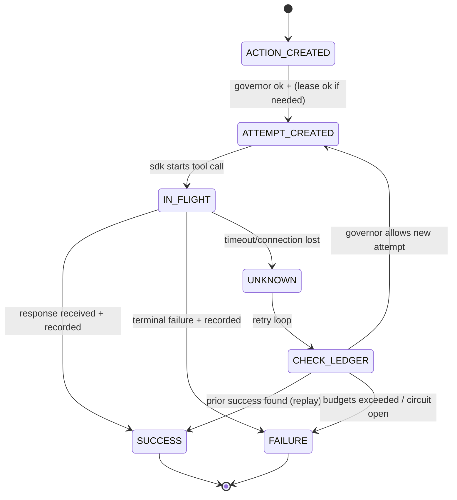
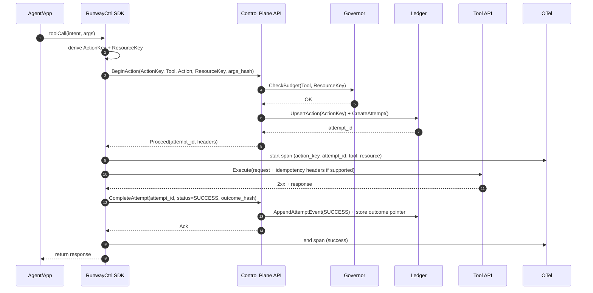
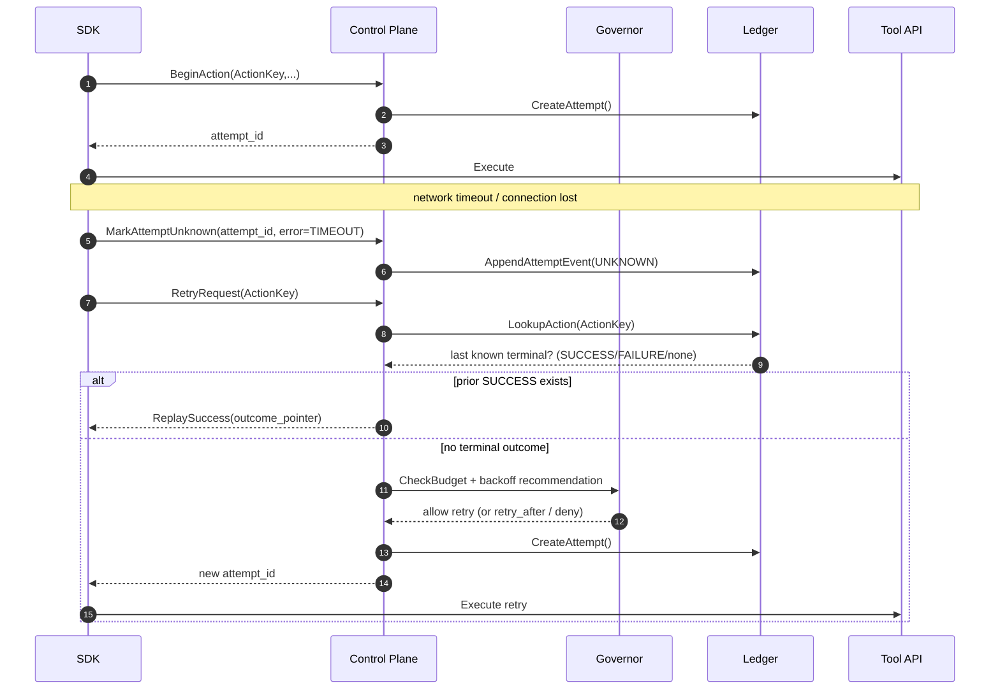
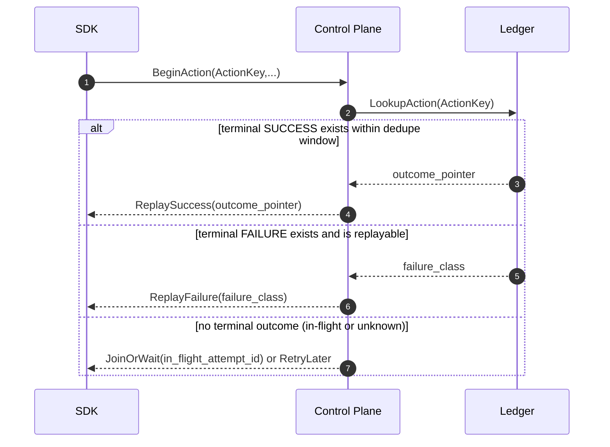
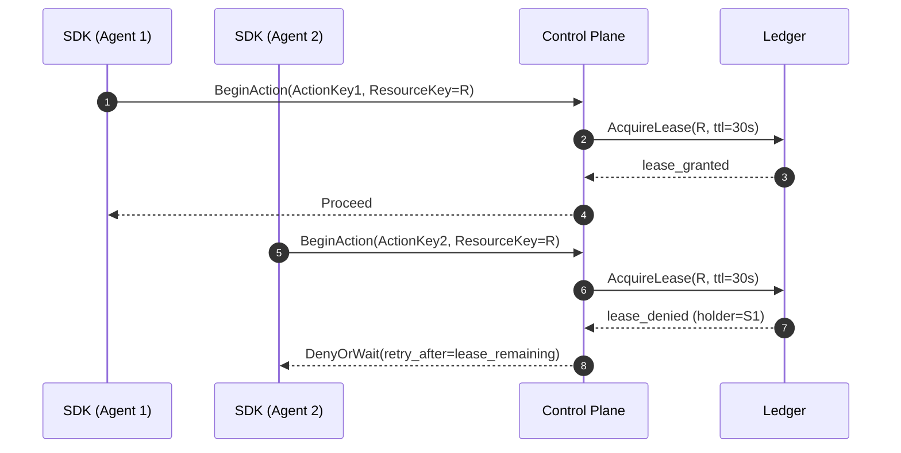
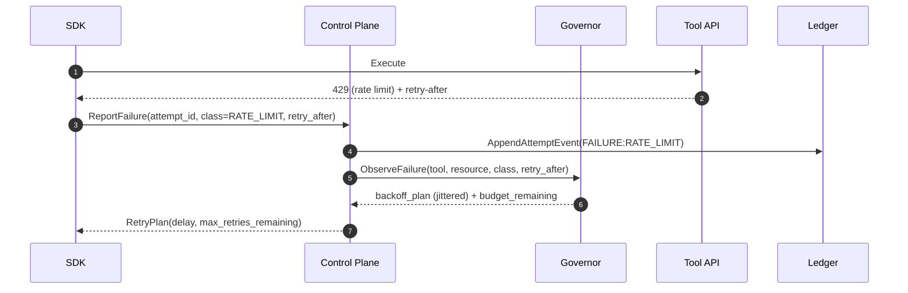
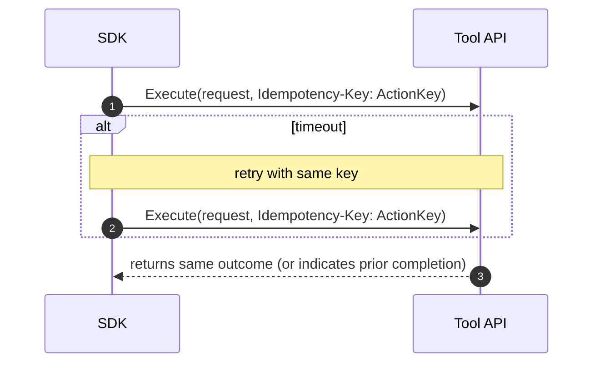
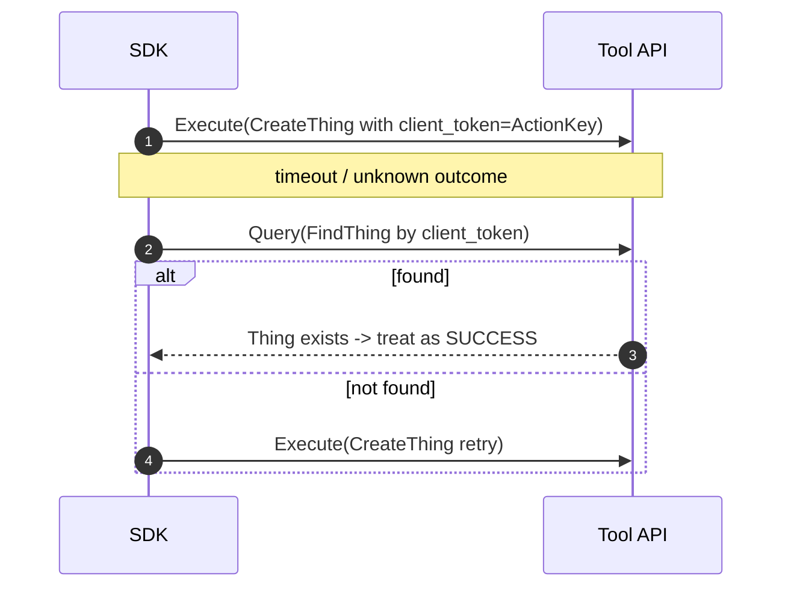
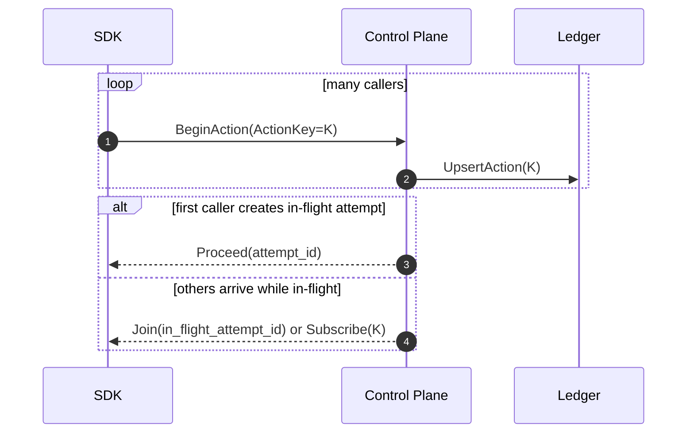
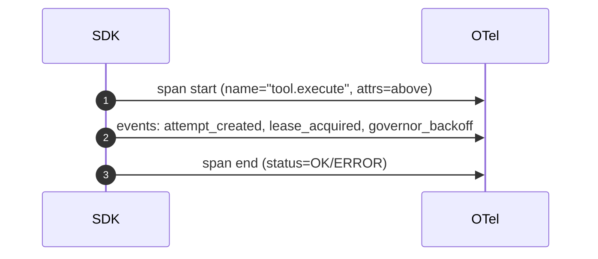

\

# RunwayCtrl — Execution Flow Document (v0.1)

| Field    | Value                                                          |
| -------- | -------------------------------------------------------------- |
| Product  | RunwayCtrl (agent execution control plane)                     |
| Document | Execution Flows (runtime sequences + state transitions)        |
| Version  | v0.1                                                           |
| Date     | January 21, 2026                                               |
| Audience | Engineers implementing SDK + Control Plane + Ledger + Governor |

---

## 1) Purpose

This document specifies **how tool executions flow through RunwayCtrl** so you can implement it in VSCode without inventing semantics mid-flight.

**Core outcomes (what “correct” means):**

- No duplicate business side-effects under retries/timeouts (**idempotent by design**).
- Bounded concurrency per tool/resource (**leases + quotas**).
- Retry storms get prevented or dampened (**budgets + backoff + circuiting**).
- Every attempt is auditable (**append-only ledger**) and observable (**OTel-first**).

### Degraded mode (control plane / ledger)

RunwayCtrl is a coordination system for **side effects**, so the safe default under partial outage is **fail-closed**: if the SDK cannot obtain a `PROCEED` decision from the Control Plane (e.g., network failure, 5xx, or the Ledger is unavailable), it MUST NOT execute the tool call “blind.” Instead it should apply bounded, jittered backoff and retry `BeginAction`, and if an `action_key` is known it SHOULD poll `GET /v1/actions/{action_key}` to replay any terminal outcome rather than re-executing. On the server side, when the system is overloaded or downstream tools are degraded, the Governor SHOULD shed load by returning safe denials (`BUDGET_DENIED`/`RATE_LIMITED`/`CIRCUIT_OPEN`) with `retry_after_ms` instead of creating new attempts. This behavior prevents duplicate real-world effects and avoids turning partial outages into retry storms.

> **v0.1 data stance:** The ledger stores hashes/pointers/metadata by default (not raw tool request/response payloads). See `Documentation/ADR-0009-payload-capture-stance.md`.

---

## 2) Scope and non-goals

### In scope

- SDK → Control Plane API → Governor → Ledger → Tool execution lifecycle
- Dedupe/replay semantics via **ActionKey**
- Concurrency control via **Lease/ResourceKey**
- Retry governance (budgets, backoff, storm detection)
- Observability contract (spans/metrics/log attributes)

### Non-goals (for v0.1)

- Full UI editing/policy management (minimal read-only dashboard is in scope)
- Full workflow orchestration engine (we integrate with them; we’re not them)
- Model prompting, memory, or agent planning (RunwayCtrl governs execution)

---

## 3) Glossary (minimal)

- **Tool**: external API or internal action target (e.g., Jira, ServiceNow, GitHub).
- **Action**: a _business intent_ (e.g., “create incident”, “update ticket status”).
- **ActionKey**: stable identifier for “same intent” to dedupe and replay results.
- **Attempt**: a single execution try for an Action (each retry is a new Attempt).
- **ResourceKey**: the concurrency boundary (e.g., `jira:issue:ABC-123`).
- **Lease**: time-bound lock on a ResourceKey to avoid parallel writers.
- **Governor**: policy engine for budgets, rate limits, storm prevention, backoff.
- **Ledger**: append-only store of actions, attempts, events, outcomes.

---

## 4) Components

- **Client App / Agent Runtime**: where business logic lives
- **RunwayCtrl SDK**: creates keys, calls RunwayCtrl, wraps tool calls
- **RunwayCtrl Control Plane API**: coordination hub (stateless-ish, uses ledger)
- **Ledger**: durability + dedupe truth (actions, attempts, outcomes, events)
- **Governor**: budgets, backoff, circuiting, concurrency policy
- **Tool Provider**: target API
- **OpenTelemetry Pipeline**: traces/metrics/logs emitted by SDK + control plane

---

## 5) Identifiers and hashing rules (contract-level)

### 5.1 ActionKey (dedupe identity)

**Intent:** “Same business effect” → same ActionKey within a dedupe window.

**Recommended construction:**

```
ActionKey = hash(
  tenant_id +
  tool_name +
  action_name +
  normalized_resource_key +
  normalized_args_subset +
  caller_provided_idempotency_hint (optional)
)
```

**Normalization rules (must be consistent):**

- Remove volatile fields (timestamps, random IDs, nonces).
- Sort JSON keys, stable encode.
- Optionally allow explicit overrides if app wants precise control.

### 5.2 ResourceKey (concurrency boundary)

ResourceKey should represent “the thing that must not have concurrent writers”.
Examples:

- `jira:issue:ABC-123`
- `servicenow:incident:INC0012345`
- `github:repo:org/repo:pr:42`

---

## 6) State machine (high level)



---

# 7) Canonical Flows (the “flow of it”)

## Flow A — Safe tool execution (happy path)

**Goal:** execute a tool action with a durable record and full observability.



**Ledger requirements:**

- Action row exists (ActionKey unique)
- Attempt row appended (AttemptID unique)
- Attempt events are append-only (immutable history)

**Payload rule (v0.1):** store `request_hash` / `outcome_hash` and (optionally) an `outcome_pointer`; do not store raw payloads in the ledger by default.

---

## Flow B — Timeout / unknown outcome (the most important flow)

**Goal:** handle “tool might have succeeded but we don’t know” safely.



**Key semantics:**

- UNKNOWN is not a failure; it means “business effect uncertain.”
- If tool supports idempotency keys, retries are safe.
- If tool does **not** support idempotency, you must use **confirmation strategy** (see Flow G).

---

## Flow C — Duplicate request / replay (same ActionKey)

**Goal:** if the same ActionKey shows up again, return the existing terminal outcome.



**Policies you must pick (v0.1 default suggestions):**

- “Join” behavior: wait for in-flight attempt up to N seconds then return `PENDING`.
- Dedupe window: 24h default (configurable).

---

## Flow D — Concurrency collision (leases on ResourceKey)

**Goal:** prevent parallel writers to same resource.



**Lease rules:**

- Lease is renewable while attempt is IN_FLIGHT.
- Lease expires automatically to avoid deadlocks.
- “Wait vs fail fast” is a per-tool/per-action policy.

---

## Flow E — Rate limits and retry governance (budgets + backoff)

**Goal:** stop retry storms and smooth recovery.



**Governor should enforce:**

- Per-tool global budgets (tokens/requests per time window)
- Per-resource budgets (hot key protection)
- Retry ceilings (attempt cap per action)
- Jittered exponential backoff (avoid synchronized herds)
- Circuit breaker (open when error rate crosses threshold)

---

## Flow F — Tool supports idempotency keys (ideal case)

**Goal:** guarantee “same ActionKey → same effect” even across retries.



**SDK rule:** if tool supports idempotency keys, **always** attach one derived from ActionKey.

---

## Flow G — Tool does NOT support idempotency (hard mode)

**Goal:** reduce duplicate side-effects using confirmation + compensations.

There are three patterns. Pick per tool/action:

### G1) Read-after-write confirmation (preferred)

- After an UNKNOWN/timeout, query for a uniquely-identifiable artifact.
- If found, mark SUCCESS and replay.

### G2) Client-generated unique IDs embedded in request

- Many APIs let you pass a client token in the payload (even if no idempotency header).
- Use ActionKey-derived token, then search by it later.

### G3) Compensating action (last resort)

- If duplicates can happen, define a compensating “undo” or cleanup.
- Record compensation in ledger with its own ActionKey.



---

## Flow H — Coalescing (many intents collapse into one)

**Goal:** if 50 agents try to “refresh the same record,” run it once and share result.



**Delivery options (v0.1):**

- Join with short wait, then return `PENDING` + poll endpoint
- Or callback/webhook later (v0.2)

---

## Flow I — Observability contract (OTel-first)

**Goal:** every attempt is searchable by trace, and every trace is searchable by attempt.

### Required OTel attributes (minimum)

- `runwayctrl.action_key`
- `runwayctrl.attempt_id`
- `runwayctrl.tool`
- `runwayctrl.action`
- `runwayctrl.resource_key`
- `runwayctrl.outcome` (SUCCESS/FAILURE/UNKNOWN)
- `runwayctrl.failure_class` (if failure)
- `runwayctrl.retry_count`
- `runwayctrl.budget_remaining`
- `runwayctrl.lease_state` (granted/denied/renewed)



---

# 8) Appendix — Minimal API surface (shape, not final)

## 8.1 Control Plane endpoints (conceptual)

- `POST /v1/actions/begin`
- `POST /v1/attempts/{attempt_id}/complete`
- `POST /v1/attempts/{attempt_id}/unknown`
- `GET  /v1/actions/{action_key}` (status + outcome pointer)
- `POST /v1/leases/acquire`
- `POST /v1/leases/renew`
- `POST /v1/leases/release` (optional; TTL handles most cases)
- `GET  /v1/insights/cost-summary` (Ledger Insights — read-only analytics)
- `GET  /v1/insights/tool-efficiency` (Ledger Insights)
- `GET  /v1/insights/retry-waste` (Ledger Insights)
- `GET  /v1/insights/hotspots` (Ledger Insights)

## 8.2 Ledger records (conceptual fields)

### Action

- `action_key` (pk)
- `tool`, `action`
- `resource_key`
- `created_at`, `updated_at`
- `terminal_status` (nullable)
- `terminal_outcome_pointer` (nullable)
- `dedupe_expires_at`

### Attempt

- `attempt_id` (pk)
- `action_key` (fk)
- `status` (IN_FLIGHT/SUCCESS/FAILURE/UNKNOWN)
- `started_at`, `ended_at`
- `failure_class` (nullable)
- `request_hash`, `outcome_hash` (nullable)
- `trace_id` (nullable but recommended)

### AttemptEvent (append-only)

- `attempt_id`
- `ts`
- `type` (CREATED/LEASE_GRANTED/TOOL_SENT/RESPONSE/UNKNOWN/COMPLETED/etc.)
- `details` (json)

---

# 9) Appendix — “Definition of Done” for v0.1

- All flows A–I are implementable with the SDK + API + ledger.
- A timeout does not create duplicate side effects for tools with idempotency support.
- Leases prevent concurrent writes for same ResourceKey.
- Governor prevents runaway retries under 429/5xx.
- Traces link to attempts and attempts link to traces.- Multi-instance correctness: all flows produce correct results with 3+ control-plane instances sharing one Postgres.
- Ledger Insights: cost summary, tool efficiency, retry waste, and hotspot data are available via read-only `/v1/insights/*` endpoints.